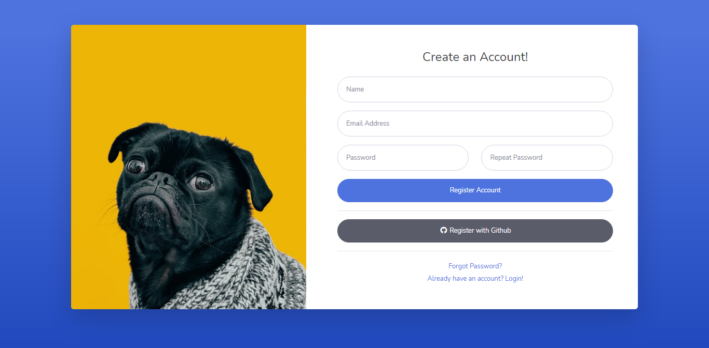
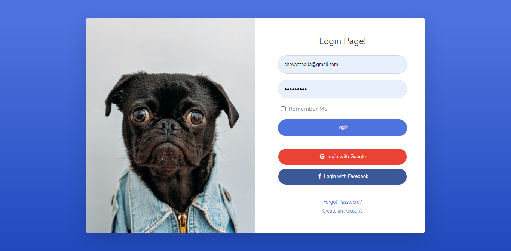
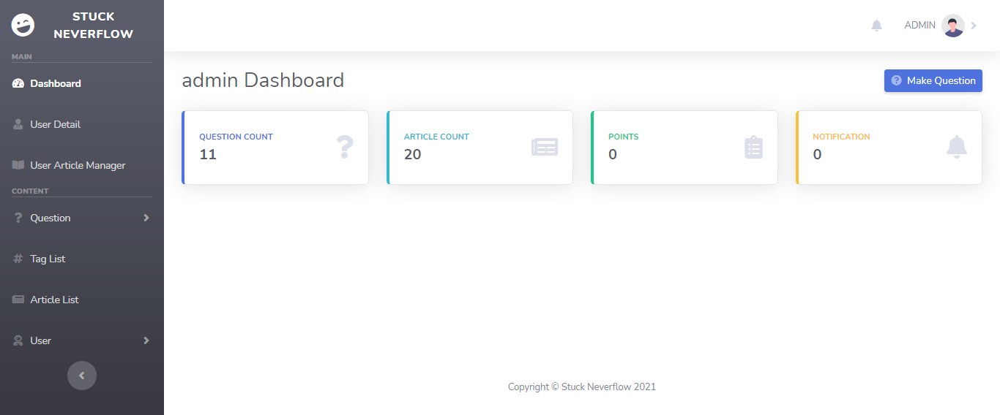
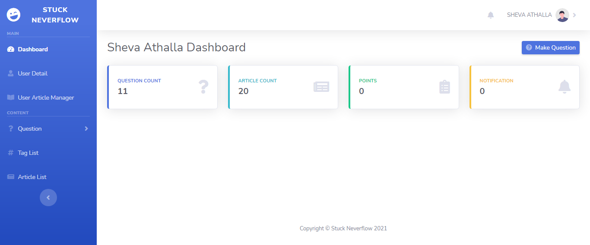
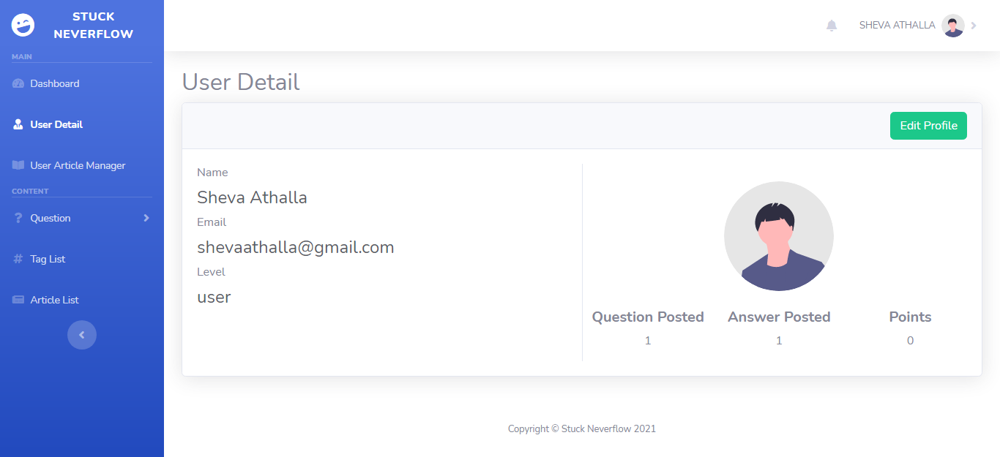

## About Stuck Neverflow

Stuck Neverflow is a forum application created using the Laravel web development framework, this application uses a template from SBadmin

## Home Page Stuck Neverflow

## Register Page Stuck Neverflow

## Login Page Stuck Neverflow

## User Level Access
Stuck neverflow have 3 level access
- [unsigned]
- [member]
- [admin]

## Dashboard
-[admin]

-[member]

## User Detail and Update Form

## Question
